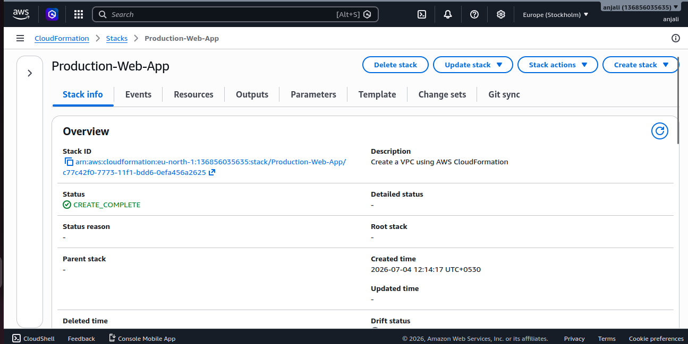
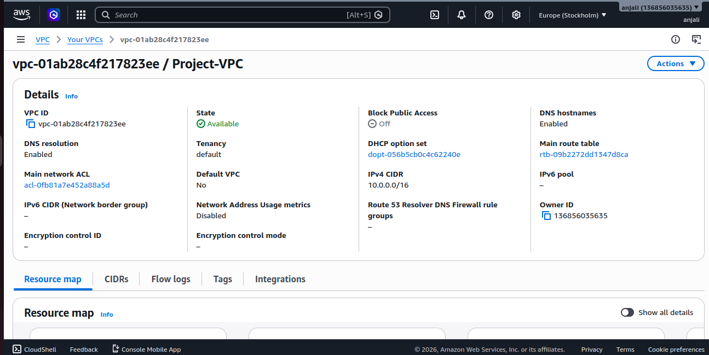
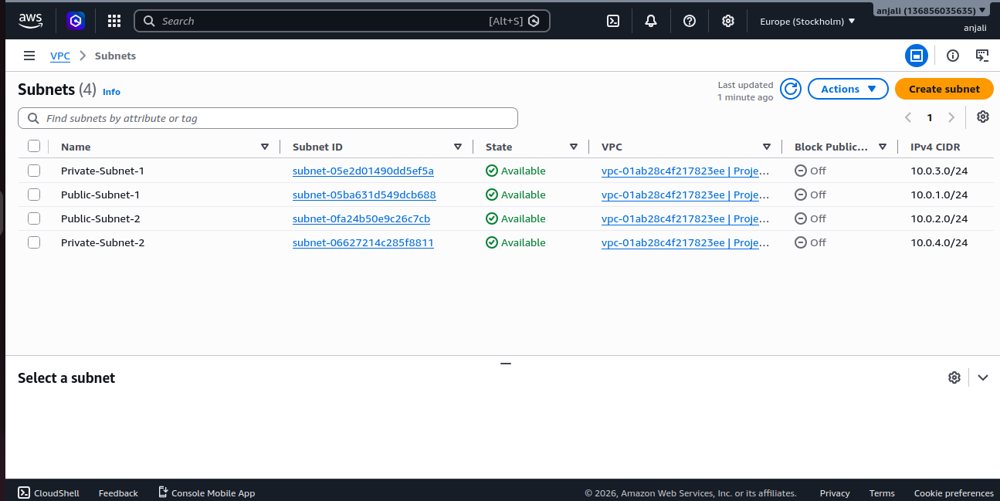
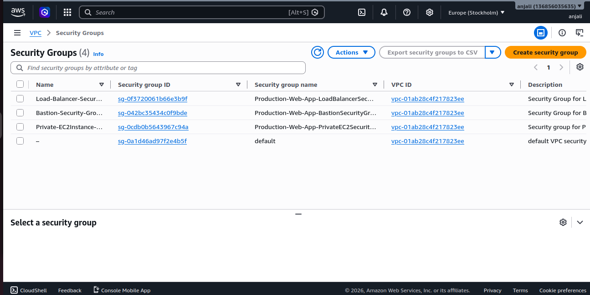
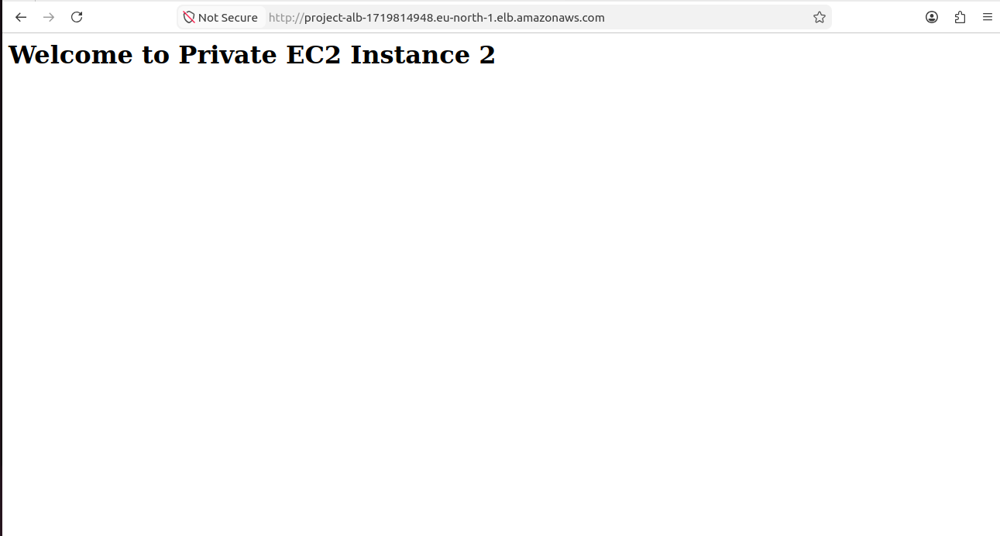

# Project Screenshots

## 1. CloudFormation Stack

CloudFormation stack successfully created.

---

## 2. VPC

Custom VPC created using CloudFormation.

---

## 3. Public and Private Subnets

Two public and two private subnets across two Availability Zones.

---

## 4. Security Groups

Security groups configured for Bastion Host, ALB, and Private EC2.

...

---

## 12. Application Output

Apache web page served successfully through the Application Load Balancer.